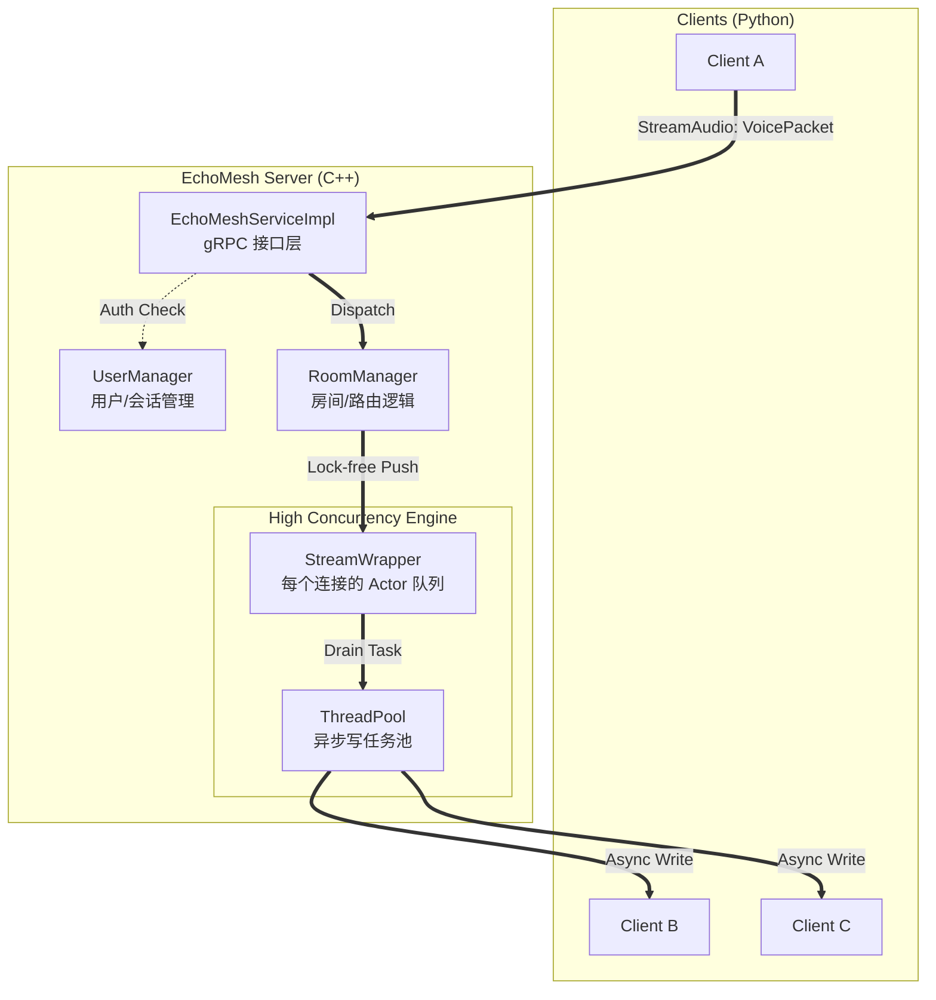

# EchoMesh - 基于 gRPC 的高性能实时语音聊天室

## 项目简介
EchoMesh 是一个功能完善的多人实时语音聊天室应用。它采用客户端-服务器架构，服务端使用 C++20 实现，作为一个高效的音频转发单元 (SFU)；客户端使用 Python 实现，能够采集、编码、发送、接收、解码并播放实时音频流。

用户可以登录、加入不同的房间，并在房间内与其他人进行双向语音通话。项目经过深度性能调优，能够支撑高并发下的稳定音频转发。

## 🏗 项目架构与核心原理

### 1. 系统架构图
项目采用基于 gRPC 双向流的异步转发架构。



### 2. 核心文件索引

#### 核心服务 (Core)
*   **`proto/message.proto`**: 定义了 gRPC 服务契约。包括 `Login`（登录）、`ManageRoom`（房间管理）和关键的 `StreamAudio`（双向音频流消息）。
*   **`src/main.cpp`**: 服务端入口。负责初始化 gRPC 服务器、绑定端口并启动服务。
*   **`src/EchoMeshServiceImpl.cpp`**: gRPC 服务的具体实现。处理流的开启、读取循环和身份验证逻辑。

#### 业务管理 (Management)
*   **`src/UserManager.cpp`**: **(单例)** 管理全局用户信息、Session Token 验证以及用户所在的房间状态。
*   **`src/RoomManager.cpp`**: **(单例)** 核心分发逻辑。维护房间列表，负责将收到的音频包分发给对应房间的所有成员。

#### 性能引擎 (Performance Engine)
*   **`include/RoomManager.h` (ThreadPool & StreamWrapper)**: 
    *   `ThreadPool`: 自定义高性能线程池，处理海量并发写任务。
    *   `StreamWrapper`: **核心亮点**。为每个流实现私有队列和 Actor 式异步写逻辑，彻底解决了锁竞争和背压问题。

#### 音频处理 (Audio)
*   **`src/audio/OpusWrapper.cpp`**: Opus 编解码器的 C++ 封装，实现高效音频压缩。
*   **`src/audio/JitterBuffer.cpp`**: 抖动缓冲区实现，平滑网络抖动带来的包乱序和延迟。

#### 测试工具 (Testing)
*   **`test_client/client.py`**: 功能客户端。支持麦克风采集、Opus 编码、gRPC 传输和音频回放。
*   **`test_client/load_tester.py`**: 性能压测工具。基于 `asyncio`，模拟大规模并发用户验证系统极限。

---

## 如何构建与运行

### 1. 依赖安装
在开始之前，请确保您已安装所有必要的依赖。

**服务端 (Debian/Ubuntu):**
```bash
sudo apt-get update
sudo apt-get install build-essential cmake libgrpc-dev libgrpc++-dev protobuf-compiler-grpc libprotobuf-dev libopus-dev portaudio19-dev uuid-dev
```

**客户端 (Python):**
```bash
# 确保已安装 Python 3 和 venv
sudo apt-get install python3 python3.12-venv
```

### 2. 构建服务端
```bash
mkdir -p build
cd build
cmake ..
make -j$(nproc)
```
编译成功后，会在 `build` 目录下生成可执行文件 `echomesh_server`。

### 3. 配置并运行客户端
我们将在单机上通过运行两个客户端来模拟语音通话。

**A. 准备 Python 环境**
```bash
cd test_client
python3 -m venv venv
venv/bin/pip install protobuf grpcio grpcio-tools pyaudio opuslib
```

**B. 查找麦克风设备**
```bash
venv/bin/python3 client.py --list-devices
```
在输出的列表中，找到代表您麦克风的 `Device Index`。

**C. 开始测试**
打开三个终端进入项目根目录：

*   **终端 1: 启动服务端**
    ```bash
    ./build/echomesh_server
    ```

*   **终端 2: 启动 Client A**
    ```bash
    cd test_client
    venv/bin/python3 client.py user_A room_1 --input-device <INDEX>
    ```

*   **终端 3: 启动 Client B**
    ```bash
    cd test_client
    venv/bin/python3 client.py user_B room_1
    ```

### 4. 性能测试 (Load Testing)
使用压测工具验证系统稳定性：
```bash
cd test_client
./venv/bin/python3 load_tester.py --clients 20 --duration 30
```

---

## 🚀 核心技术点

1.  **gRPC 双向流**: 统一了信令与音频传输通道，利用 HTTP/2 的多路复用能力提升传输效率。
2.  **异步化分发架构**: 
    -   **读写分离**: `Read` 循环不被 `Write` 阻塞。
    -   **写合并**: 每个连接独占排水任务，消除全局锁竞争。
3.  **高可用设计**: 
    -   **Load Shedding**: 任务积压时主动丢包，保护核心服务。
    -   **内存安全**: 完善的智能指针策略，避免高并发下的竞态与悬挂指针。
